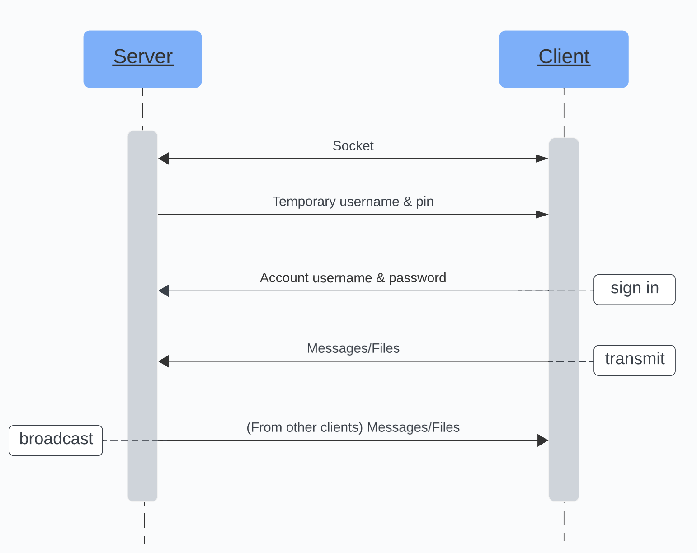
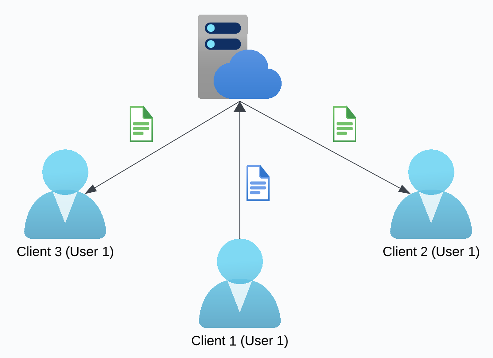

# Architecture

Min-send empowers users to seamlessly transmit messages and files across various devices. The application has two parts: a server-side and a client-side. Clients connected to the same server-side can transmit messages and files at will.

## Server-side

First starters, the client connects to the server with socket. After successful connection, the server allocates the client a temporary username and a corresponding n-digit pin. The client can then sign in to the system with a different username and the corresponding pin. One socket connection corresponds to one client, but several users can use the same username to sign in.

For instance, a person opens the client app with a laptop (client A) and gets a temporary username and pin. Then the person opens the client app with a cell phone (client B) and signs in with the temporary username and pin. In this case, both client A and client B are connected to the same user. If client A sends out a message, the client B can receive the message immediately. The server will delete the message after all clients receive the message.

The client is deleted when the socket is disconnected. The temporary username will be removed from the server when the last client that uses it is deleted.

Assume that a user is connected to three clients: client 1, client 2, and client 3. The client 1 can send a file to the server. Once the server receives the file, it broadcasts the file to other clients, namely, client 2 and client 3. Note that clients that use different usernames will not receive the file.

### Client

A client is created immediately after a socket connection is formed. Server can receive a message or a file from a client, or send a message or a file to a client. A client is always bound to a user.

### User

A user is created immediately after a client is created. At first, a temporary user is created, and it is assigned to the client. Users can change a user on the client-side. If the user successfully sign in with another account, the client will be bound to another user.

A user is destructed when the last client that is bound to it is destructed. 

## Client-side